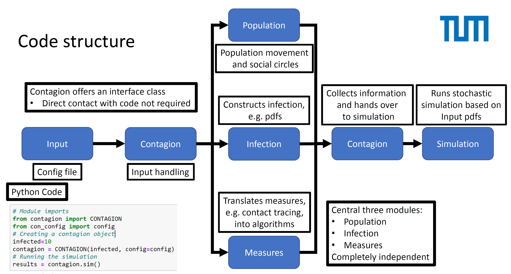

# Contagion

Authors:

1. Christian Haack
2. Stephan Meighen-Berger
3. Andrea Turcati

## Table of contents

[[_TOC_]]

## Introduction

A python package to simulate the spread of diseases in a population.
The code is structured modular, allowing for easy extension/change
of the steps required in modelling the spread. The model is similar to the
analytic SIR model and it's extensions. Switching between these models
is done by setting the corresponding parameters for the infection.

## Model

The Model is structed as


## Code Example

A basic running example to interface with the package

```python
# Importing the package
import contagion as CONTAGION
# Importing the config file
import con_config as config
# The number of infected
infected = 10
# Creating contagion object
contagion = CONTAGION(infected, config=config)
# Runing the simulation
results = contagion.sim()
```

## Code structure

On overview of the code structure


## TODO

- [] Optimize population calculations
  - [] Change contact definition
  - [] Optimize sampling precedure
- [] Add Incubation
- [] Add immunity function to infection
- [] Add a switch between the different models (SIR, SIS, MSIR, MSEIRS...)
- [] Fix that tracked person currently can't meet infected (only passive)
