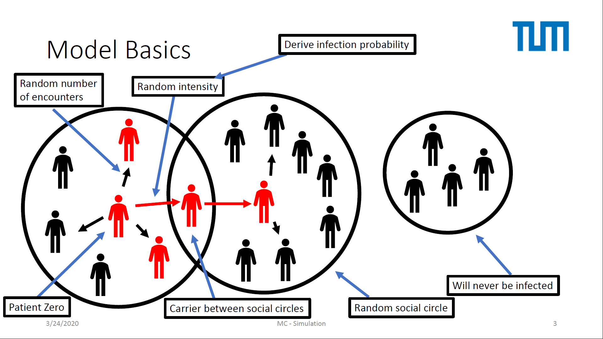

contagion
--------------------------------------------------------------------------------
Authors: Stephan Meighen-Berger
A python package to simulate the spread of diseases in a population.
The code is structured modular, allowing for easy extension/change
of the steps required in modelling the spread.
The Model is structed as

